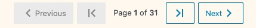
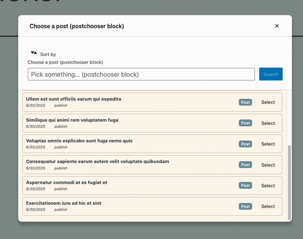
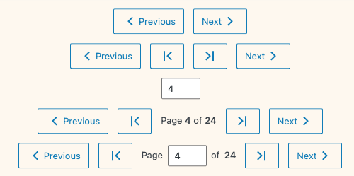

# Pagination






## Status: BETA

A customizable pagination component that provides navigation controls for data that spans multiple pages. This component works well with the `useGetPagination` hook to handle fetching pagination information for WordPress data.

## Features

- First/Last page buttons
- Previous/Next navigation
- Page number display
- Jump-to-page input field
- Fully customizable display options
- Accessible navigation controls with proper button labels
- Icons from the Noun Project
- Configurable inline style margins - margin styles can be passed as props to the component to avoid having to write styles for the component itself.


## Layout Options


This screenshot shows 6 different ways to customize the layout of the Pagination component.

## Usage

```jsx
import { Pagination } from '@bostonuniversity/block-components';
import { useState } from '@wordpress/element';

const MyComponent = () => {
  const [currentPage, setCurrentPage] = useState(1);
  const totalPages = 10; // Total number of pages available

  return (
    <Pagination
      currentPage={currentPage}
      totalPages={totalPages}
      onChange={(newPage) => setCurrentPage(newPage)}
    />
  );
};
```

## Props

| Prop | Type | Default | Description |
|------|------|---------|-------------|
| `currentPage` | Number | Required | The currently active page |
| `totalPages` | Number | Required | Total number of pages available |
| `onChange` | Function | Required | Callback function triggered when page changes |
| `showPageNumbers` | Boolean | `true` | Whether to show the current page and total pages |
| `showFirstLastButtons` | Boolean | `true` | Whether to show first/last page buttons |
| `showPrevNextButtons` | Boolean | `true` | Whether to show previous/next buttons |
| `showJumpToPage` | Boolean | `false` | Whether to show a text input for jumping to a specific page |
| `margin` | Object | `{}` | Custom margin settings with optional `marginBlock` and `marginInline` properties |

## Examples

### Basic Pagination

```jsx
<Pagination
  currentPage={1}
  totalPages={5}
  onChange={(page) => console.log(`Navigated to page ${page}`)}
/>
```

### Minimal Pagination (Only Previous/Next)

```jsx
<Pagination
  currentPage={1}
  totalPages={5}
  onChange={(page) => console.log(`Navigated to page ${page}`)}
  showFirstLastButtons={false}
  showPageNumbers={false}
/>
```

### With Jump-to-Page Input

```jsx
<Pagination
  currentPage={3}
  totalPages={10}
  onChange={(page) => console.log(`Jumped to page ${page}`)}
  showJumpToPage={true}
/>
```

### With Custom Margins

```jsx
<Pagination
  currentPage={1}
  totalPages={5}
  onChange={(page) => console.log(`Navigated to page ${page}`)}
  margin={{
    marginBlock: '2rem',
    marginInline: '1rem'
  }}
/>
```

### Combined with useGetPagination and useRequestData

```jsx
import { Pagination } from '@bostonuniversity/block-components';
import { useGetPagination, useRequestData } from '@bostonuniversity/block-imports';
import { useState } from '@wordpress/element';

const PostList = () => {
  const [page, setPage] = useState(1);

  // Get pagination information
  const { pagination } = useGetPagination('postType', 'post', {
    per_page: 10,
    status: 'publish'
  });

  // Get posts for current page
  const [posts, isLoading] = useRequestData('postType', 'post', {
    per_page: 10,
    page: page,
    status: 'publish'
  });

  return (
    <div>
      {isLoading ? (
        <p>Loading posts...</p>
      ) : (
        <>
          {/* Display posts here */}
          {posts && posts.map(post => (
            <div key={post.id}>{post.title.rendered}</div>
          ))}

          {pagination.totalPages > 1 && (
            <Pagination
              currentPage={page}
              totalPages={pagination.totalPages}
              onChange={setPage}
              showJumpToPage={true}
              margin={{ marginBlock: '1.5rem' }}
            />
          )}
        </>
      )}
    </div>
  );
};
```
