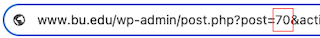

# PostChooser Component



## Overview

The PostChooser component provides a flexible and user-friendly interface for selecting WordPress posts, pages, or other custom post types within the block editor. It offers a modal dialog with advanced search capabilities, filtering options, and a clear results display.

## Status: BETA

This component is currently in beta status and may undergo minor changes before final release.

## Features

- **Advanced Search Options**:
  - Text search (searches post title and content)
  - Slug search (finds posts by exact slug)
  - ID search (finds posts by ID)
  - Recent posts listing

- **Filtering & Sorting**:
  - Filter by post type (posts, pages, custom post types)
  - Sort by date or title
  - Sort in ascending or descending order

- **User-Friendly Interface**:
  - Modal dialog with search controls
  - Real-time search with debounced API requests
  - Loading indicators for search operations
  - Pagination for large result sets
  - Clear and informative empty state messaging

- **Performance Optimized**:
  - Debounced search to reduce API calls
  - Separate state for immediate UI feedback and delayed API requests
  - Efficient pagination implementation

## Installation

```bash
npm install @bostonuniversity/block-imports
```

## Basic Usage

```jsx
import { PostChooser } from '@bostonuniversity/block-imports';

const MyBlockEdit = (props) => {
  const { attributes, setAttributes } = props;

  // Create some attributes to store the returned post id and post title.
  const { selectedPostId, selectedPostTitle } = attributes;

  // Handle post selection. The component just returns the selected post. Your block must
  // decide what to do with this. Typically you'll want to save the post id, and perhaps other data from
  // the post object such as the title. However if your block is going to use a php template on the frontend
  // you might be best only saving the post ID and fetching everything else dynamically. This way if the
  // post title changes it's not saved in this block's attributes.
  const handleSelectPost = (post) => {
    setAttributes({
      selectedPostId: post.id,
      selectedPostTitle: post.title.rendered
    });
  };

  return (
    <div className="my-block">
      {/* Only onSelectPost is required, other props have defaults */}
      <PostChooser
        onSelectPost={handleSelectPost}
      />

      {selectedPostId && (
        <div className="selected-post">
          <p>Selected post: {selectedPostTitle} (ID: {selectedPostId})</p>
        </div>
      )}
    </div>
  );
};
```

## Using PostChooserSidebar

The PostChooser component also exports a sidebar component for use in the block inspector panel:

```jsx
import { PostChooser, PostChooserSidebar } from '@bostonuniversity/block-imports';

const MyBlockEdit = (props) => {
  const { attributes, setAttributes } = props;
  const { selectedPostId, selectedPostTitle, selectedPostLink } = attributes;

  // Handle post selection
  const handleSelectPost = (post) => {
    setAttributes({
      selectedPostId: post.id,
      selectedPostTitle: post.title.rendered,
      selectedPostLink: post.link
    });
  };

  return (
    <>
      {/* Main block UI */}
      <div className="my-block">
        {selectedPostId ? (
          <div className="selected-post">
            <p>Selected post: {selectedPostTitle}</p>
          </div>
        ) : (
          <PostChooser onSelectPost={handleSelectPost} />
        )}
      </div>

      {/* Inspector sidebar - only postID, postTitle, and onRemove are required */}
      <PostChooserSidebar
        postID={selectedPostId}
        postTitle={selectedPostTitle}
        postURL={selectedPostLink}
        onRemove={() => setAttributes({
          selectedPostId: null,
          selectedPostTitle: null,
          selectedPostLink: null
        })}
      />
    </>
  );
};
```

## Props

### PostChooser Props

| Prop | Type | Default | Description |
|------|------|---------|-------------|
| `onSelectPost` | Function | Required | Function called when a post is selected |
| `modalLabel` | String | "Search for posts" | Label for the search field |
| `modalTitle` | String | "Choose a Post" | Title for the modal dialog |
| `postTypes` | Array | `[{ label: 'Posts', value: 'post' }, { label: 'Pages', value: 'page' }]` | Array of post type objects with label/value pairs |
| `primaryPostType` | String | "post" | Default post type to use |
| `searchPlaceholder` | String | "Enter a search term..." | Placeholder text for the search field |
| `onClose` | Function | `() => {}` | Function called when the modal is closed |

### PostChooserSidebar Props

| Prop | Type | Default | Description |
|------|------|---------|-------------|
| `postID` | Number | Required | ID of the selected post |
| `postTitle` | String | Required | Title of the selected post |
| `postURL` | String | - | URL of the selected post |
| `onOpenPostChooserModal` | Function | `() => {}` | Function called when "Change Post" is clicked |
| `onRemovePost` | Function | Required | Function called when "Remove Post" is clicked |
| `removePostButtonLabel` | String | "Remove" | Label for the remove post button |
| `openButtonLabel` | String | "Select Post" | Label for the open post chooser button |
| `changeButtonLabel` | String | "Change" | Label for the change post button |
| `panelTitle` | String | "Selected Post" | Title for the sidebar panel |
| `showPostLink` | Boolean | true | Whether to show a link to the post |
| `children` | ReactNode | - | Additional content to display in the sidebar |

## Customization Examples

### Working with Custom Post Types

```jsx
import { PostChooser } from '@bostonuniversity/block-imports';

const CustomPostTypeSelector = (props) => {
  const { attributes, setAttributes } = props;
  const { selectedPostId, selectedPostTitle } = attributes;

  const handleSelectPost = (post) => {
    setAttributes({
      selectedPostId: post.id,
      selectedPostTitle: post.title.rendered
    });
  };

  return (
    <div className="custom-post-type-selector">
      <PostChooser
        onSelectPost={handleSelectPost}
        modalTitle="Choose a Team Member"
        modalLabel="Search for team members"
        searchPlaceholder="Enter team member name..."
        // Include your custom post types in this array
        postTypes={[
          { label: 'Team Members', value: 'team_member' },
          { label: 'Posts', value: 'post' },
          { label: 'Pages', value: 'page' }
        ]}
        // Set your custom post type as the primary/default type
        primaryPostType="team_member"
      />

      {selectedPostId && (
        <div className="selected-team-member">
          <p>Selected team member: {selectedPostTitle}</p>
        </div>
      )}
    </div>
  );
};
```

### Customizing for Multiple Post Types with a Different Default

```jsx
import { PostChooser } from '@bostonuniversity/block-imports';

const MultiPostTypeSelector = (props) => {
  const { attributes, setAttributes } = props;
  const { selectedPostId, selectedPostTitle, selectedPostType } = attributes;

  const handleSelectPost = (post) => {
    setAttributes({
      selectedPostId: post.id,
      selectedPostTitle: post.title.rendered,
      selectedPostType: post.type // Store the selected post type
    });
  };

  return (
    <div className="multi-post-type-selector">
      <PostChooser
        onSelectPost={handleSelectPost}
        modalTitle="Choose Content"
        // Make pages the primary post type instead of posts
        primaryPostType="page"
        // Include event custom post type
        postTypes={[
          { label: 'Pages', value: 'page' },
          { label: 'Posts', value: 'post' },
          { label: 'Events', value: 'event' }
        ]}
      />

      {selectedPostId && (
        <div className="selected-content">
          <p>
            Selected {selectedPostType}: {selectedPostTitle}
          </p>
        </div>
      )}
    </div>
  );
};
```

## Component Architecture

The PostChooser is composed of several subcomponents:

1. **PostChooserModal**: Main container for the modal dialog
2. **SearchUI**: Search input field and post type selector
3. **ResultsControls**: Search type selection and sorting controls
4. **Results**: Container for displaying search results
5. **ResultsItem**: Individual post item display
6. **LoadingOverlay/LoadingSpinner**: Loading indicators

Each subcomponent is designed to be focused on a specific part of the user interface, promoting maintainability and separation of concerns.

## Dependencies

- WordPress Core Data Store (`@wordpress/core-data`)
- WordPress Components (`@wordpress/components`)
- WordPress Element (`@wordpress/element`)
- WordPress Block Editor (`@wordpress/block-editor`)

## Related Components

- [Pagination](../Pagination/README.md) - Used for results pagination

## Related Hooks

- [useDebouncedInput](../../hooks/useDebouncedInput/README.md) - Used for search input debouncing
- [useRequestData](../../hooks/useRequestData/README.md) - Used for data fetching
- [useGetPagination](../../hooks/useGetPagination/README.md) - Used for pagination management
