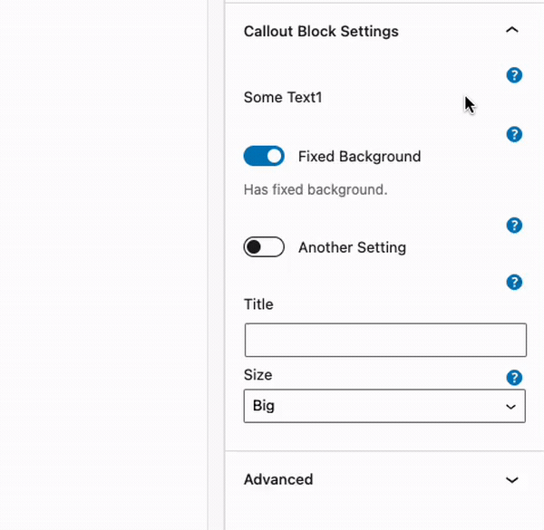

https://github.com/bu-ist/bu-block-components/tree/develop/components/help-wrapper

# BU Help Wrapper
## Status: BETA



An component that can wrap core components in the sidebar and provide a quick and easy help
popover component to display inline help and/or links to external documentation.

This is a wrapping component, to use it wrap it around another component such as a ToggleControl
or TextControl in the InspectorControls.

## Props

### className
Allows you to pass a class to apply to the component

### text
The text property let's you pass the text string to display in the popover. This can also be a JSX component.

### offset
Pass a value of `label` to offset the help icon by a negative 18px to position the icon to the right
of the label on core components such as TextControl.

## Usage
```js
import { BU_Help_Wrapper } from '@bostonuniversity/block-components';
```


```js
<BU_Help_Wrapper
	text={ <p>Does Something. <a href="https://wpdocs.bu.edu">Read More</a> </p>}
>
	<p>Some Text</p>
</BU_Help_Wrapper>
<BU_Help_Wrapper
	text="Some message for the tooltip">
	<ToggleControl
		label="Fixed Background"
		help={'Has fixed background.'}
		checked={ true }
	/>
</BU_Help_Wrapper>
<BU_Help_Wrapper
	text={ <p>Does Something. <ExternalLink href="https://wpdocs.bu.edu">Read More</ExternalLink> </p>}
>
	<ToggleControl
		label="Another Setting"
		checked={ false }
	/>
</BU_Help_Wrapper>
<BU_Help_Wrapper
	text={ <p>Does Something. <ExternalLink href="https://wpdocs.bu.edu">Read More</ExternalLink> </p>}
>
	<TextControl
		label="Title"
	/>
</BU_Help_Wrapper>
<BU_Help_Wrapper
	text={ <p>Does Something. <ExternalLink href="https://wpdocs.bu.edu">Read More</ExternalLink> </p>}
	offset="label"
>
	<SelectControl
		label="Size"
		options={ [
			{ label: 'Big', value: '100%' },
			{ label: 'Medium', value: '50%' },
			{ label: 'Small', value: '25%' },
		] }
	/>
</BU_Help_Wrapper>
```
