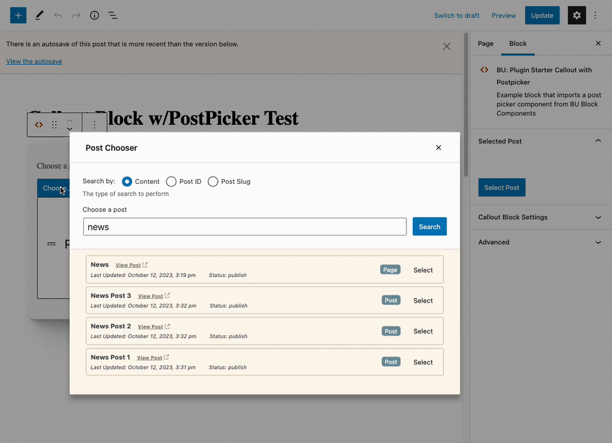

https://github.com/bu-ist/bu-block-components/tree/develop/components/image

# BU Image
## Status: BETA

**Image component the user can edit**


**Image component the user cannot edit as the image id is set elsewhere**


An image display component for use within a block. This component can
display an image by passing it a media ID. The component also supports
uploading or selecting an image from the media library and allowing the
user to remove the image.

The developer can choose to use this component with or without the ability
to edit, select, or remove the image.

For example if the image should always be displayed and the ID of the image
is already known such as the featured image by getting it using the Post
Chooser component along with the rest of the post data you can choose to
not permit the image to be removed by leaving the `onRemove` function passed
to the component empty. You'll also want to set `canEditImage` to false so
that no edit controls are presented to the user.

To prevent the user from editing (overriding) the featured image leave the
option `canOverrideImage` to false.

This component can be used when building a block and you do want to allow the
user to upload or select an image from the media library. This would be the
typical case when there is no previously selected post to grab an image from.

In that scenario you'll want to setup your own `onSelect` handler, and `onRemove`
handlers.


The Component also supports an optional Focal Point Control to allow
the focal point of the image to be set for use with Object-Fit scaling.

## Usage
```js
import { BU_Image } from '@bostonuniversity/block-components';
```


```js
const handleImageSelect = ( media ) => {
	console.log("image Selected:", media);
	setAttributes({
		selectedPostIMG: media?.id
	})
};

const handleImageRemove = () => {
	setAttributes({
		selectedPostIMG: undefined
	})
};


<BU_Image
	className="my-custom-block-image"
	id={ selectedPostIMG }
	labels={{
		title: 'Select Image',
		instructions: 'Upload an image or pick one from your media library.'
	}}
	canEditImage={true}
	canOverrideImage={true}
	focalPoint={focalPoint}
	onChangeFocalPoint={handleFocalPointChange}
	onSelect={handleImageSelect}
	onRemove={handleImageRemove}
/>
```
